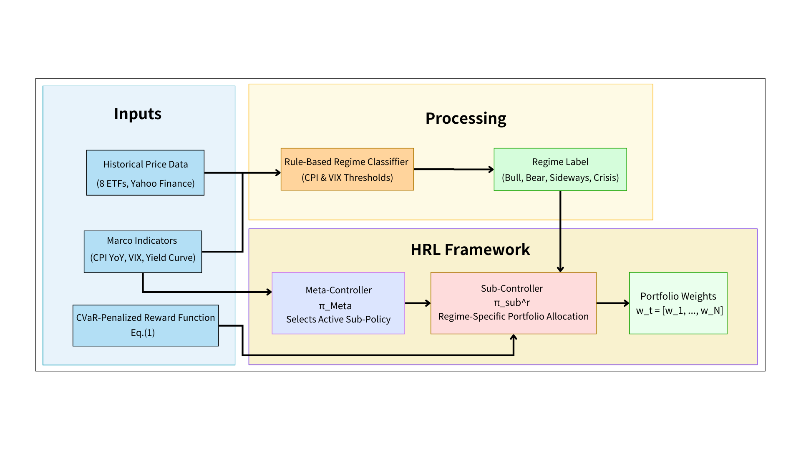
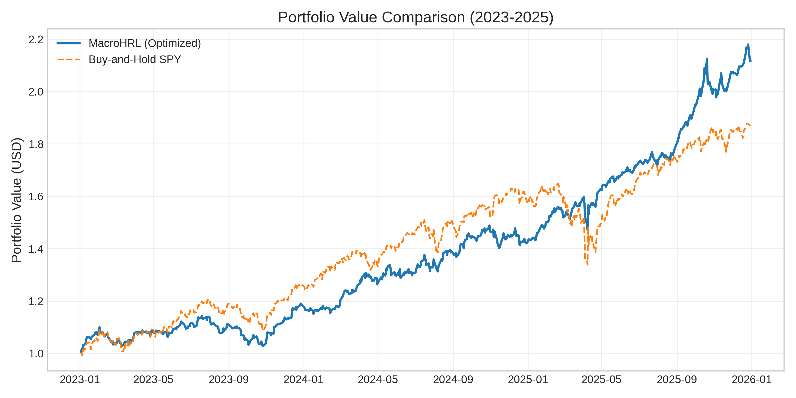
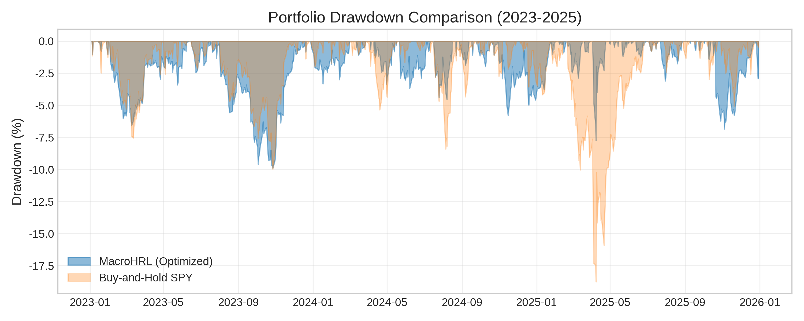

# MacroHRL

**A Hierarchical Reinforcement Learning Framework for Risk-Aware Portfolio Management**

Neelesh Nayak, Peter Lian, Tony Xia — University of Waterloo

**Project Write Up:** [View the Project](https://cucai.ca/papers/34)

---

## Overview

MacroHRL is a two-level hierarchical reinforcement learning framework for portfolio
management that treats drawdown minimization as a primary design objective rather than
a secondary constraint.

- **Meta-Controller** — a PPO agent that selects a market regime (Bull, Bear, Crisis,
  Sideways) once per quarter from macroeconomic state.
- **Sub-Controllers** — four PPO agents, one per regime, each trained only on that
  regime's historical episodes, producing daily portfolio weights.

Tail risk is penalized directly in the sub-controller reward via CVaR.



## Method

**Sub-controller reward (Eq. 1 in the paper):**

$$R_k = r^p_k - c \sum_{i=1}^{N} |w_{k,i} - w_{k-1,i}| - \lambda \cdot \mathrm{CVaR}_\alpha(L_k)$$

where $r^p_k$ is the daily portfolio return, $c$ the transaction cost, and $\lambda$ the
risk-aversion coefficient on the CVaR of recent losses $L_k$.

**Regime classification** (priority-ordered rule set):

| Regime | Rule |
|---|---|
| Crisis | VIX > 30 **and** SPY 63-day drawdown < -10% |
| Bear | CPI YoY > 5.5% (and not Crisis) |
| Sideways | 20 ≤ VIX ≤ 30 **and** \|SPY 63-day drawdown\| < 8% |
| Bull | all other periods |

## Data

- **Assets (daily close):** SPY, QQQ, EFA, EEM, TLT, HYG, GLD, VNQ — 2010–2025.
- **Macro indicators:** VIX, CPI (YoY), Treasury yields — sourced from FRED and Yahoo Finance.
- **Split:** train 2010–2022, test out-of-sample 2023–2025.

## Results (out-of-sample, 2023–2025)

| Strategy | Sharpe | Ann. Return | Max Drawdown | Calmar |
|---|---|---|---|---|
| **MacroHRL (selected)** | **1.753** | **28.07%** | **-9.90%** | **2.835** |
| Buy-and-Hold SPY | 1.616 | 24.80% | -18.76% | 1.322 |

MacroHRL cuts maximum drawdown roughly in half relative to SPY while improving
annualized return - a Calmar ratio more than 2× the benchmark.

| Portfolio value | Drawdown |
|---|---|
|  |  |

## Repository layout

```
train_backtest.py            Full HRL pipeline: trains sub-controllers + meta-controller,
                             backtests 2023-2025, writes results/ and figures/
sweep.py                     Hyperparameter sweep behind Table I (results/sweep_results.csv)
make_architecture_figure.py  Generates figures/fig1_architecture.png
data/                        Raw price and macro inputs
figures/                     Figures used in the paper
results/                     Backtest metrics and sweep output
paper/                       CUCAI Project Write Up
```

## Reproducing

```bash
pip install -r requirements.txt

python train_backtest.py            # main result + figures 2 and 3
python sweep.py                     # hyperparameter sweep 
python make_architecture_figure.py  # figure 1
```

Run all scripts from the repository root — they resolve `./data` and `./results`
relative to the working directory. Seeds are fixed (`seed=42`), but exact PPO results
still vary slightly across PyTorch/CPU versions.

## Limitations

- The out-of-sample window is a single ~3-year period; results are not a multi-regime
  robustness study.
- The regime classifier is rule-based, not learned; the Meta-Controller learns *which
  specialist to deploy*, not the regime boundaries themselves.

## Future work

Additional macro signals, multi-agent coordination between sub-controllers, LLM-assisted
macro reasoning, and a real-time deployment pipeline.
